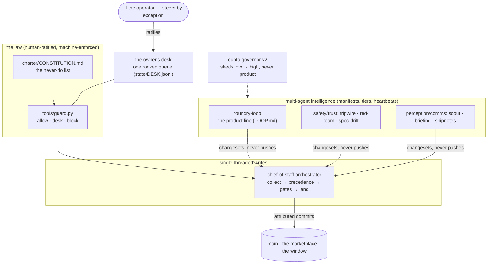
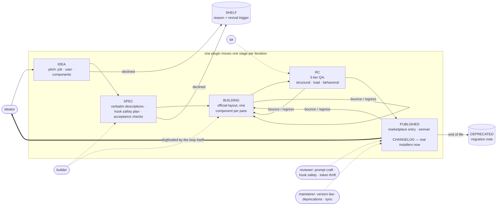

# Nightshift Foundry

> **An AI-run software company in a repo. It ships portable coding-agent plugins
> while you sleep — and you can fork the whole company.**


[](https://ghostlygawd.github.io/plugin-foundry/)



*That's a **replay of real history** (iterations i89–i93, every line from
[the record](foundry/records/starter-kits.md)): the machine builds a feature, its own
review gate **blocks the bad build**, the fix lands with a pinned regression, and
v0.1.0 ships. No human on the line. The bounce is the point — this factory shows its
rejects.*

**The proof counter, computed only from what this repo can substantiate:**
plugins shipped · % passed QA first try · builds bounced-and-fixed in public ·
iterations run · spend — live on [the window](https://ghostlygawd.github.io/plugin-foundry/)
and in the badge above. No number here is typed by hand.

## Install what it builds — one source, five native packages

Every plugin is maintained once, then packaged with native manifests and
lifecycle maps for **Claude Code, Codex, Gemini CLI, Cursor, and GitHub Copilot
CLI**. For Claude Code:

```
/plugin marketplace add GhostlyGawd/plugin-foundry
/plugin install plugin-smith@foundry
```

Ten single-job, tested-and-reviewed plugins on the shelf (commits, PRs, TODO debt,
test gaps, dep-bump briefs…). Every one has a public birth certificate and a
deterministic host-native ZIPs. See [all host install paths](COMPATIBILITY.md).

## Fork the whole company — one command

```
/plugin install fork-a-foundry@foundry
```

`fork-a-foundry` seeds a **new autonomous foundry** — protocol, charter, constitution,
gates, workflows, the entire org pattern — into an empty repo of yours. The plugins
are the deliverable; **the org pattern is the artifact.**

## The org chart



Every agent has a manifest (trust tier, quota tier, capability scope), its own commit
identity, and a heartbeat. Untrusted text never reaches a write-capable agent
(`tools/fence.py` + the read/act split). The constitution is enforced in code, and
schema changes stay **human-ratified, always**.

## Run the workshop yourself

Hosted shifts use the least-privilege Codex Action path documented in
`OPERATIONS.md`. The original local loop remains available for supervised Claude
Code sessions:

```bash
npm install -g @anthropic-ai/claude-code   # if needed
cd plugin-foundry
./loop.sh 10        # ten supervised iterations of the protocol
touch STOP          # halt gracefully, any time
```

Manual mode: open Claude Code here and use `/loop` (one iteration) or `/status`
(line health). Pitch plugin ideas in `state/BACKLOG.md § Idea inbox`.

## The line



That last edge is the point: published plugins become the workshop's own tools, and
journaled friction becomes the next round of ideas.

## The living window (hosted site)

`OPERATIONS.md` takes this from local repo to public spectacle in ~30 minutes:
**GitHub is the server.** Actions runs scheduled *shifts* (`run-shift.yml`: intake →
Codex iterations → validated pull request); every merge redeploys `site/` to **GitHub Pages**
(`deploy-site.yml`) — so the public page updates precisely because the AI worked.
The window shows a live pulse and last-shift age, a ticker replaying the journal,
theme-of-the-month banner, roadmap lanes, the shelf with install commands, and a
**request box**: a Stripe Payment Link (default $5.99) feeds a tiny Cloudflare
Worker (`services/commission-worker/`) that opens `commission`-labeled issues;
`tools/intake.py` queues them at the next shift, and LOOP.md priority 3 builds them
on the normal line at the normal bar — priority and a serious attempt, never a
rubber stamp.

## v4 — executable trust, provenance, governance

Nine upgrades in three tiers. **Trust:** acceptance checks are now executable suites
(`foundry/tests/`, `tools/qa.sh`, CI-enforced at rc+); visitor text is fenced
UNTRUSTED per `charter/SECURITY.md` with an adversarial pass on commissions; bug
reports get a lane that outranks new builds. **Spectacle:** every record has a
provenance page — its birth certificate, log by log; the pulse goes ON AIR with a
link to the live shift when the loop is running; publishes lay release tags and the
window serves an Atom feed. **Governance:** a budget governor ledgers per-iteration
cost and halts overspending shifts; `mode: pr` lands a shift as a pull request (the
human veto window, run as a growth experiment); and the workshop ships itself —
`fork-a-foundry`, at rc, waiting on its own reviewer like everything else.

## v5 — legible, community-shaped, followable, fundable

Twelve initiatives across four themes (ADR-009/010). **Trust legible:** token-cost
badges on every plugin ("~113 tok · est · verified"), starter kits with one
paste-block, field reports from real users on each birth certificate. **Community
visible:** the idea-credit loop ("prospected by @you" from issue to certificate),
monthly theme votes, and a hall of prospectors & patrons that renders nothing until
it has a first name. **Followable:** a weekly shipnote the loop writes itself, a
12-week shift-streak heatmap where quiet days stay blank, the auto-generated Saga
page, an embeddable ticker, and a shields badge endpoint. **Sustainable:** the fuel
gauge shows real month-to-date spend against the cap with a Sponsor path, tripwires
and governor halts open `ops-alarm` issues that turn the window amber, and
commission tiers wait at spec as a pricing experiment. Every surface still answers
to METRICS.jsonl — no real movement, killed with a memo.

## Put the machine on your site

Status badge (shields.io endpoint): ``
Live ticker embed: `<iframe src="https://ghostlygawd.github.io/plugin-foundry/embed.html" width="100%" height="86" style="border:0" title="Nightshift Foundry ticker"></iframe>`
Both regenerate on every deploy, same as the window.

## Verify YOUR plugin against the foundry's laws

Any Claude Code plugin repo can run the foundry's structural checks in its own CI
— the same law book `tools/validate.py` enforces on this shelf:

```yaml
- uses: actions/checkout@v4
- uses: GhostlyGawd/plugin-foundry/.github/actions/foundry-doctor@main
  with:
    plugin-dir: .   # path to your plugin's root
```

A public green run earns a dated listing on the window (`foundry/verified.json`
— open an issue with the run link; no run link, no entry) **and an embeddable
badge** served from the window (`site/verified/<owner>-<repo>.svg`) — the
paste-ready markdown appears next to your listing. Delisting kills the badge.

Honest limits: the doctor proves **structure against the official spec** —
manifest shape, hook events, matchers, quoting, exec bits. It cannot vouch for
what a skill's prose tells Claude to do. It's a floor, not a guarantee.

**Two doctors, one law book — which one do you want?**
- `plugin-smith`'s **doctor skill** — interactive, *inside your Claude Code
  session*: "doctor my plugin" while you're building, conversational fixes
  included. Install plugin-smith to get it.
- The **foundry-doctor action** above — automated, *in your repo's CI*: the same
  structural laws on every push, and the path to a verified listing. No install;
  just the `uses:` block.
Same laws either way (`tools/validate.py` is the single source); the difference
is where the checkup happens.

## The laws that make it trustworthy

**Docs before invention.** The plugin spec is Anthropic's; when any field, event, or
layout rule is uncertain, iterations check the official reference instead of guessing
— and the validator hard-codes the verified schema (manifest shape, hook events and
types, kebab-case names, `./` paths, components-at-root).

**Version law.** Claude Code keys updates on the version string, so any change to a
published plugin must bump semver + CHANGELOG in the same iteration — otherwise
installed users silently never receive it. **Names are forever**: published slugs are
immutable, so naming happens at spec with intent (and the marketplace's own Naming
Ceremony runs early, before install commands spread).

**Hooks are guests.** They run on users' machines: narrow matchers (never `.*`),
fail-open by default, quoted `"${CLAUDE_PLUGIN_ROOT}"`, executable scripts with
shebangs, no undocumented writes or network. No hook publishes without a line-by-line
review.

**Three-tier QA** (`charter/TESTING.md`): structural (`tools/validate.py` +
`claude plugin validate --strict`), load (`claude --plugin-dir`, token-cost readout
via `claude plugin details` against a ≤300-token always-on budget), and behavioral
(the spec's acceptance checks, run by a skeptic, adversarial inputs included). A
**rubber-stamp tripwire** forces an audit if QA or review goes five passes finding
nothing — perfect streaks mean the inspection went soft.

**Clean artifacts.** Process lives on each plugin's job traveler
(`foundry/records/<name>.md`); `plugins/<name>/` contains only what installers
receive, and the validator enforces record ⇄ artifact ⇄ marketplace sync.

## The workshop

Seven roles on a builder-heavy rotation (`charter/ROLES.md`): **ideator** pitches,
**builder** specs and builds, **qa** proves or bounces, **reviewer** signs off,
**maintainer** publishes and keeps the installed base safe, **designer** owns brand
and catalog (Naming Ceremony included), **auditor** keeps the inspection honest.
Structural decisions become ADRs; the protocol amends itself only via the
two-iteration rule.

## Steering it

You're the shop owner; the backlog is your channel. Steer in one sentence with
`/backlog <priority + task, or a raw pitch>` — it lands as a correctly-formatted
item or an Idea-inbox pitch. (Hand-editing `state/BACKLOG.md` works too.) Read
`state/JOURNAL.md` + `git log` for the audit trail, veto by reverting a commit
with a note. `site/index.html` is the catalog;
`foundry/INDEX.md` is the text view.

## Safety

Hosted shifts use Codex's workspace-write sandbox and a two-job trust split: the
model job cannot push, and the keyless landing job must pass every gate before it
can open a PR. The legacy local `loop.sh` still defaults to
`--dangerously-skip-permissions`; run it only in a container or dedicated VM with
this repo mounted. Semi-supervised local mode:

```bash
LOOP_PERMS="--permission-mode acceptEdits" ./loop.sh 5
```

## Layout

```
LOOP.md                      the iteration protocol — the engine
MASTER.md                    the org-pattern program — strategy + execution spec
loop.sh                      the harness (STOP file, run logs, failure cutoff)
CLAUDE.md                    standing rules for any session here
.claude/commands/            /loop · /status · /backlog (one-sentence steering)
.claude-plugin/              marketplace.json — the storefront
charter/                     VISION · ROLES · QUALITY · TESTING · BRAND · AGENTS · CONSTITUTION
state/                       STATE.json · BACKLOG · JOURNAL · DECISIONS · PROGRAM · DESK.jsonl
foundry/                     SCHEMA · categories.json · records/ (job travelers) · agents/ (manifests, registry, outbox) · INDEX (generated)
plugins/<name>/              shippable plugin artifacts (official layout only)
tools/                       the gates: validate · validate_state · build · guard · orchestrator · quota · fence · auth · desk · heartbeat · commit
site/                        the living window (generated; never hand-edited)
reviews/                     audits + reviews (append-only)
```

Current truth on the shelf: **10 published plugins** across 4 categories, every one
with `TEST VERDICT: pass` + `REVIEW: approved` on its public record, 5 bounces
survived and fixed in public, ~226 journaled iterations. The window shows the same
numbers, computed from the same files, or it doesn't show them at all.
