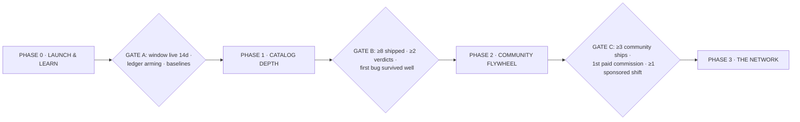

# ROADMAP — from v5 to the network

Phases advance on **evidence gates**, not dates. Ownership: `loop` = the machine
builds it in shifts · `operator` = human wiring · `community` = powered by
participants · `world` = needs real time/users. The Auditor verifies gates and
checks boxes; nobody else touches them.

## Phase 0 — Launch & Learn
- [x] Publish fork-a-foundry through the v4 gates (loop)
- [x] Four building features → rc with fixture QA (loop)
- [x] Naming Ceremony — ADR-011 (loop)
- [ ] Pages + ANTHROPIC_API_KEY + budget variable (operator — OPERATIONS.md §1–3, 7)
- [ ] First CI shift: metrics baselines arm, shipnote #1 posts (world)

**Gate A:** window live 14 days · BUDGET.jsonl has real entries · 6 experiments
have baselines. — [ ] (auditor verifies)

## Phase 1 — Catalog Depth
- [x] Ship the pool: commit-craft, session-recap, env-doctor, pr-narrator (loop)
- [x] Recipes on every published certificate (loop)
- [x] Compatibility stamps — `tested_with` mechanism; values arm in CI (loop)
- [ ] First public keep/kill experiment verdicts (world — review dates in BACKLOG)
- [ ] First organic bug survived well: fix + regression test + happy reporter (world)

**Gate B:** ≥8 published records · ≥2 experiment verdicts · bug SLO met once. — [ ]

## Phase 2 — Community Flywheel
- [x] Co-op lane law: human spec-PRs, machine builds, shared credit (loop → CONTRIBUTING.md)
- [x] Specs on the line: adversarial-qa-bounties (loop)
- [ ] Commission tiers wired + first Sponsors push (operator — records/commission-tiers.md)
- [ ] First co-op ship, first bounty honored (community)

**Gate C:** ≥3 community-sourced ships · first paid commission delivered ·
≥1 sponsored shift credited. — [ ]

## Phase 3 — The Network
- [x] Specced: foundry-network (fork registry, network.json) (loop)
- [x] Idea pool: live-shift-theater, cross-foundry-exchange (loop)
- [ ] First sister foundry registered; first cross-foundry idea lands (world)

## v7 portfolio — COMPLETE ✓ (i35–i86, audit-002 verified; 12/12 published)
Build order: counter-index, trust-card, window-watchability, demo-transcripts,
live-shift-theater, night-clerk (flagship), contributor-cards, traveler-pings,
the-almanac, the-mailbag, commission-queue, releases-and-reverify.
Pillars: meet users where they are - make the machine watchable - skin in the game.

## Always-on lane
Experiment reviews on their dates · monthly audits · bug SLO (fix ships with the
regression test) · theme votes · Monday shipnotes. North star: weekly installs
(unique-clone proxy) × returning uniques. Guardrails: kill rate > 0 · cost/ship
trending down · alarm response < 48h.
